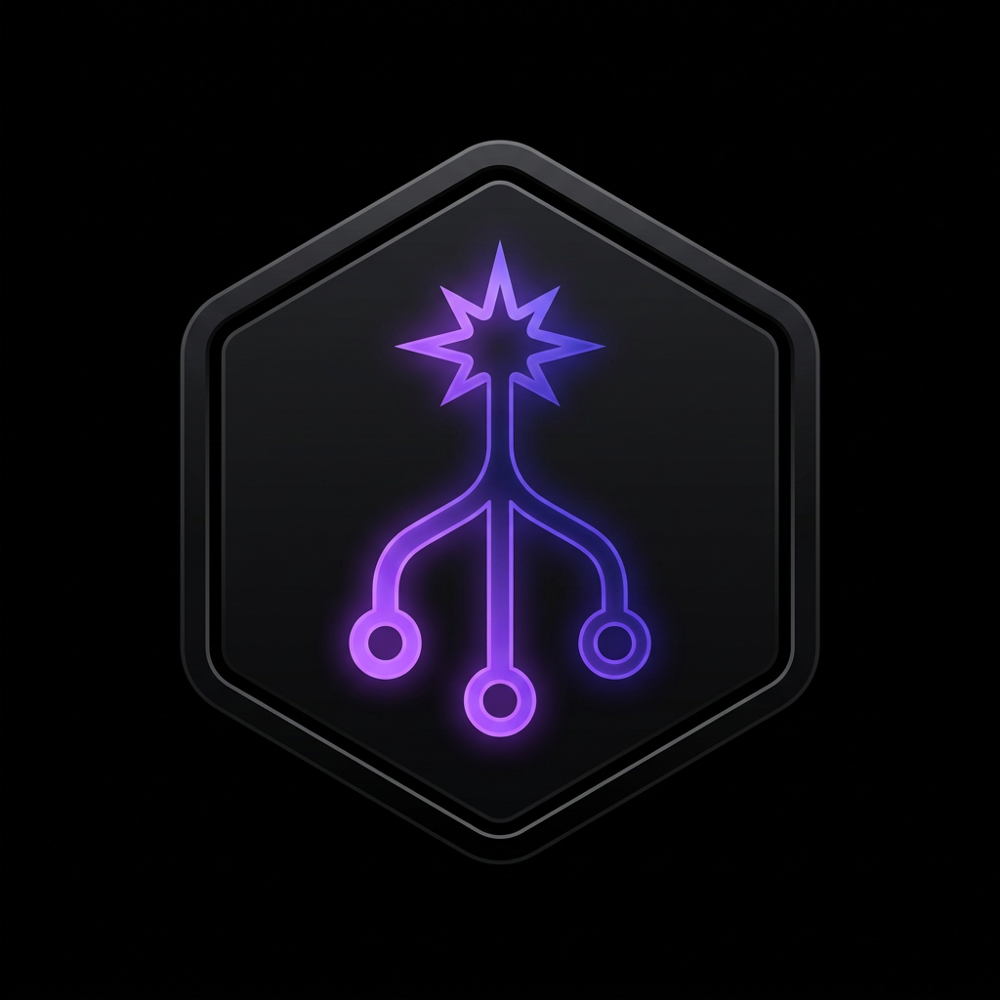

<div align="center">



# ⚡ GitVibe

**Verwandle jedes Git-Repository in einen optimalen AI-Coding-Prompt.**

[](LICENSE)
[](https://nextjs.org)
[](https://www.typescriptlang.org)
[](Dockerfile)
[](https://github.com/0xgetz/GitVibe/pulls)
[](https://github.com/0xgetz/GitVibe)
[](https://github.com/0xgetz/GitVibe/issues)
[](https://github.com/0xgetz/GitVibe)
[](DEPLOY.md)
[](README.md#datenschutz)

Füge eine GitHub-/GitLab-/Bitbucket-/Self-hosted-Git-URL ein → erhalte erprobte Prompts,
mit denen Claude, Cursor, Grok und Co. das Projekt *neu aufbauen, erweitern oder forken* können.

100% Open Source · selbst hostbar · null Tracking · MIT

**🌐 Sprachen:** [English](README.md) · [Bahasa Indonesia](README.id.md) · [简体中文](README.zh-CN.md) · [Español](README.es.md) · [Deutsch](README.de.md)

</div>

---

## Warum GitVibe

[GitReverse](https://www.gitreverse.com) kann nur eines: ein Repo in einen "Vibe-Coding"-Prompt verwandeln.
GitVibe kann mehr, läuft auf deiner eigenen Maschine und meldet sich nie nach Hause:

| | GitReverse | **GitVibe** |
|---|:---:|:---:|
| GitHub | ✅ | ✅ |
| GitLab / Bitbucket / Gitea (self-hosted) | ❌ | ✅ |
| Unterordner-/Monorepo-Pfad-Reverse | ❌ | ✅ |
| Abgestufter Kontext (Quick → Ultra) | ❌ | ✅ |
| Mehrere Prompt-Varianten | ❌ | ✅ (4) |
| Tech-Stack- & Architektur-Erkennung | basic | ✅ tief |
| Token-Schätzer | ❌ | ✅ |
| Eigener LLM (Ollama/Groq/OpenRouter/Anthropic/OpenAI) | ❌ | ✅ |
| Prompt-Bibliothek | ❌ | ✅ |
| Export (MD/JSON/TXT/CLAUDE.md/.cursorrules) | ❌ | ✅ |
| Selbst hostbar / Open Source | ❌ | ✅ |
| Tracking / Telemetrie | etwas | **keins** |

## Funktionen

- **Multi-Plattform** — GitHub, GitLab, Bitbucket und jedes selbst gehostete Gitea/GitLab per Host + Token.
- **Kontext-Intelligenz** — erkennt Sprachen, Frameworks, Architektur (MVC / Clean / Monorepo / Next.js App vs. Pages Router), Datenschicht, Testing, CI/CD, Infra. Priorisiert hochwertige Dateien (`README`, `package.json`, `tsconfig`, Dockerfiles, Migrationen, Einstiegspunkte) und liest sie in Rangfolge.
- **Abgestufte Kontextmodi** — `Quick` (README + Baum + Metadaten), `Standard`, `Deep` (kritische Dateiinhalte + Architektur-Zusammenfassung), `Ultra` (vollständige modulare Aufschlüsselung).
- **4 Prompt-Varianten** — Vibe Coding · System Prompt + Agent Instructions · Step-by-step Rebuild · Fork & Improve.
- **Token-Schätzer** — Budget pro Modus, damit du nie das Kontextfenster sprengst.
- **Unterordner-Reverse** — analysiere nur `apps/web` eines riesigen Monorepos.
- **Eigener LLM** — Deep/Ultra können mit einer echten Architektur-Zusammenfassung von Ollama (lokal & kostenlos), Groq, OpenRouter, Anthropic oder OpenAI angereichert werden. Quick/Standard brauchen **gar kein** LLM.
- **Prompt-Bibliothek** — Prompts speichern, kopieren, löschen (lokales SQLite).
- **Export** — Markdown, JSON, Klartext, `CLAUDE.md`, `.cursorrules`.
- **Moderne UI** — Next.js 15, Tailwind, shadcn-artige Komponenten, Dark Mode, voll responsiv.
- **Sicherheitsgehärtet** — SSRF-Schutz für selbst gehostete Hosts, Schutz vor Cache-Poisoning, Rate Limiting, Body-Größen-Limits, null Tracking.

## Schnellstart (Docker)

```bash
git clone https://github.com/0xgetz/GitVibe.git gitvibe && cd gitvibe
cp .env.example .env          # optional: Tokens / LLM-Keys hinzufügen
docker compose up --build     # → http://localhost:3000
```

Möchtest du auch einen gebündelten lokalen LLM?

```bash
docker compose --profile ollama up --build
docker exec -it gitvibe-ollama ollama pull qwen2.5-coder:7b
```

## Schnellstart (lokale Entwicklung)

```bash
npm install
cp .env.example .env
npm run dev                   # → http://localhost:3000
```

Erfordert **Node.js 20 oder 22 (LTS)** — better-sqlite3 kompiliert ein natives Binding, und die
Toolchain (Build-Tools) muss vorhanden sein. Neuere Node-Versionen (z. B. 26) werden **noch nicht** unterstützt.

## Konfiguration

Alles ist optional — die App startet mit Null-Konfiguration. Siehe [`.env.example`](./.env.example) für die vollständige Liste. Highlights:

- `GITHUB_TOKEN` / `GITLAB_TOKEN` / `BITBUCKET_TOKEN` — höhere Rate Limits & private Repos lesen. (Du kannst auch pro Anfrage ein Token in der UI einfügen; es wird nie gespeichert.)
- `OLLAMA_BASE_URL`, `GROQ_API_KEY`, `OPENROUTER_API_KEY`, `ANTHROPIC_API_KEY`, `OPENAI_API_KEY` — aktivieren AI-Architektur-Zusammenfassungen. Nur die konfigurierten Provider erscheinen in der UI.
- `RATE_LIMIT_MAX`, `RATE_LIMIT_WINDOW_MS` — eingebautes Rate Limit pro IP.
- `MAX_DEEP_FILES` — Obergrenze für Dateien, die bei Deep/Ultra gelesen werden.
- `TRUST_PROXY` — setze `1` **nur** hinter einem Reverse-Proxy, der das clientseitige `X-Forwarded-For` entfernt.
- `MAX_BODY_BYTES` — maximale JSON-Body-Größe (Standard 1 MB).

## So funktioniert's

```
URL ─▶ providers.ts ─▶ orchestrator ─▶ analyzer (Stack/Arch/Ranking)
                                     └▶ Token-Schätzer
                                     └▶ Prompt-Builder ─▶ [+ LLM-Zusammenfassung] ─▶ 4 Varianten
```

1. `parseRepoUrl` normalisiert jede URL (inkl. `/tree/<branch>/<subpath>`) zu einem `RepoRef`.
2. Der passende Provider-Client holt Metadaten, den vollständigen Dateibaum und die README.
3. Der Analyzer erkennt Stack/Architektur und rankt Dateien nach Nützlichkeit; Deep/Ultra lesen die Top N.
4. Die Prompt-Builder bauen einen Kontextblock zusammen und verpacken ihn in die Anweisungen jeder Variante. Deep/Ultra stellen optional eine LLM-generierte Architektur-Zusammenfassung voran.

## API

Alle Routen sind einfaches JSON unter `/api`:

- `POST /api/analyze` — `{ url, mode, provider?, host?, token?, ref?, subpath? }` → Analyse
- `POST /api/generate` — `{ analysis, mode, variants?, useLlm?, llmProvider? }` → Prompts
- `GET/POST/DELETE /api/library` — CRUD der Prompt-Bibliothek
- `POST /api/export` — `{ format, repoFullName, prompts }` → Datei-Download

## Datenschutz

Keine Analysen, keine Telemetrie, keine Drittanbieter-Aufrufe außer dem Git-Host und dem LLM-Provider *deiner Wahl*. Tokens pro Anfrage werden nur im Speicher verwendet und nie auf die Festplatte geschrieben. Anonyme Analysen öffentlicher Repos werden 10 Minuten im Speicher gecacht; nichts anderes verlässt deinen Server.

## Deployment

Siehe [`DEPLOY.md`](./DEPLOY.md) für Docker-, Bare-Metal-, Vercel- und Reverse-Proxy-Hinweise.

## Lizenz

[MIT](./LICENSE). Mach damit, was du willst. Beiträge willkommen.
